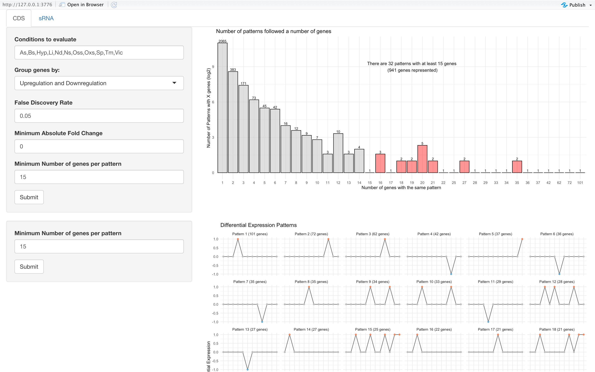
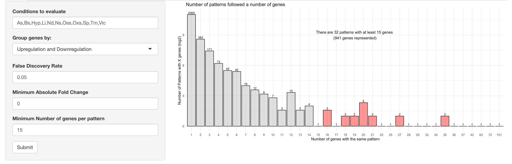
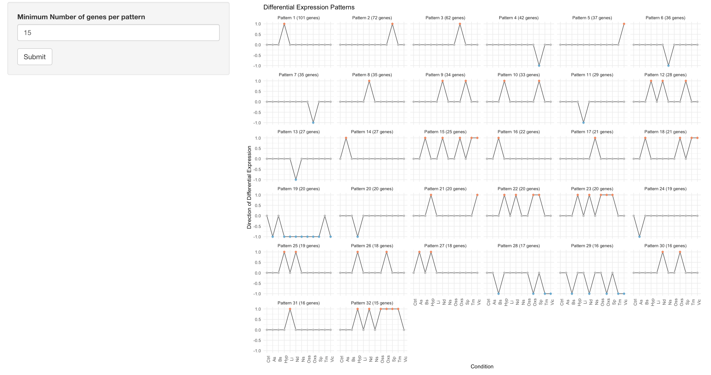
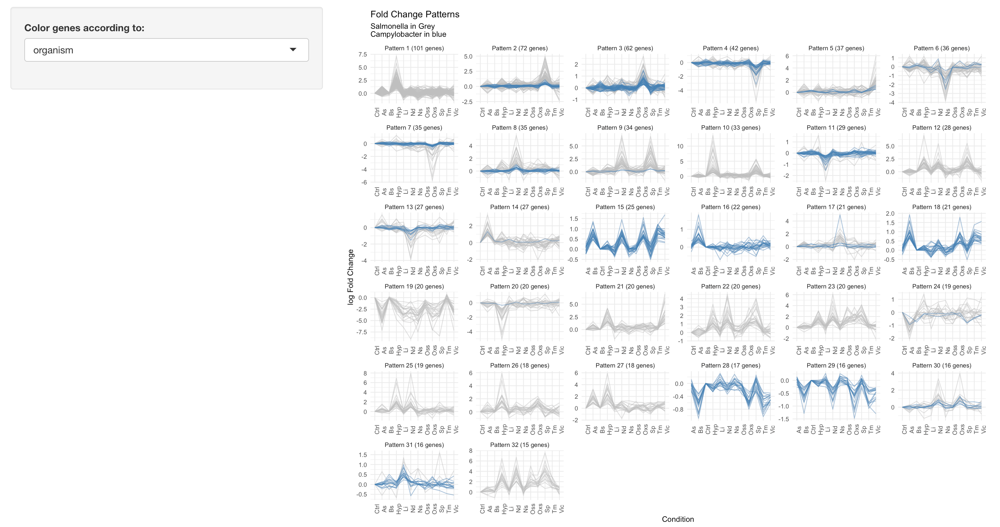
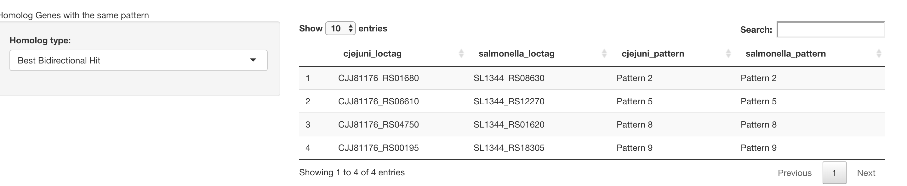
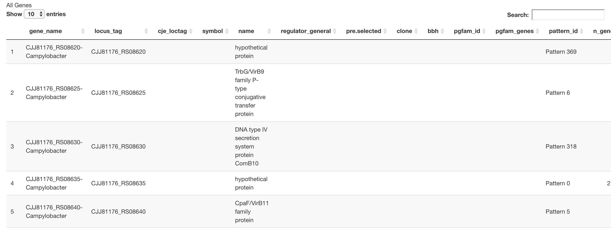

  
  
This app is meant to help us pick out some representative genes, and take a look at the patterns the occur.  
This analysis is based on grouping together genes based on their differential expression patterns with respect to the Ctrl condition. Each gene can now be described as a vector of 1 (upregulated), 0 (not differentially expressed), and -1 (downregulated) to signal their behavior in each condition.   

This is a brief tutorial on how to use this app.    
# Requirements  
To use the app, you need the following things:  
  
1. Rstudio  
2. install the library called "shiny"
3. install the other libraries necessary for the app (should install automatically after you download the app)


# How do I start the app?  
In order to use the app you can run the following commands in the Rstudio console:  
```{r eval=FALSE}
library(shiny)
runUrl("https://github.com/rolayoalarcon/reporter_app_de/raw/main/reporter_selection_de.zip")
```
  
You might get an error, asking you to install some libraries in order to run the app. This is ok and should not take too long.
You can install these with the following command
```{r eval=FALSE}
install.packages("package name")
``` 

After a few seconds, you will see a screen like this.    

  
You will notice that there are two tabs, one for sRNAs and one for CDSs. They both have the same structure, so I will show the examples with the CDSs. 
Everything should also apply to the sRNAs.  
  
The main page contains five main sections.   
  
  
## Section 01: Pattern behavior and sizes.   
The first section consists of a set of parameters on the sidebar and a bar graph in the center.  
  

  
### Parameters
There are five parameters we can play with when looking at our patterns:  
  
1. *Conditions to evaluate*: These would be the stress conditions for which we would like to look at the patterns. You can remove conditions by simply erasing them from the input line. A couple of things to keep in mind: make sure that the input does not end in a ",", and also make sure there is no space between a "," and the next condition. This means "As,Bs,Hyp" would be accepted, but "As, Bs, Hyp," would not be accepted. Some have suggested that we remove the virulence inducing condition (vic).  
2. *Group genes by*: We group together genes that follow the same differential expression pattern; this means that genes that become up-regulated and down-regulated in the same conditions will belong to the same group. This parameter allows you to choose whether genes should be grouped based on up-regulated and down-regulated behavior or to *only* consider up-regulation. It might be useful to only consider genes that are active in a condition. Also, I've noticed that there is a greater number of homologous genes that follow the same pattern when we only consider up-regulation.    
3. *False Discovery Rate*:  As mentioned in the introduction, this analysis is based on differential expression analysis. Briefly, we use the *DESeq2* package to evaluate whether genes are differentially expressed in a condition with respect to Ctrl. This is done through a statistical test, that generates a p-value. Since we test multiple genes, there is a need to correct for multiple hypothesis testing. We adjust the p-value cutoff with the Benjamini-Hochberg procedure. For this, we need a False Discovery Rate in order to select a new p-value cutoff and maintain our desired false positive rate. We adjust the p-value cutoff for each condition separately.    
4. *Minimum Absolute Fold Change*: Genes will only be considered as differentially expressed if their log Fold Change in expression with respect to control is above this threshold. This is an additional filter to the False Discovery Rate. If we select a minimum fold change of 1.5, for example, a gene will only be considered differentially expressed if the p-value is below the adjusted threshold *and* their absolute log Fold Change is above the given filter.  
5. *Minimum Number of genes per pattern*: We can use the information in the plot to guide the decision for the minimum number of genes that follow the same pattern in order for said pattern to be considered in the rest of the analysis. An explanation of the plot is found below.  
  
The plot shows the relationship between the number of genes that follow a given differential expression pattern, and the number of patterns followed by a given number of genes. The *y*-axis shows the number of patterns followed by the number of genes shown in the *x*-axis. The *y*-axis is in log scale, but the real number of patterns followed by *x* genes is shown on the top of each bar. Most patterns are followed by a few number of genes. Very few patterns are followed by a lot of genes.
   
In red you see the patterns that are followed by the *Minimum Number of genes per pattern* highlighted. The text in the middle of the plot will tell how many patterns are followed by at least the *Minimum Number of genes per pattern* parameter, and also the total number of genes that would be considered.  

## Section 02: Showing the patterns    
Once we have selected parameters in the section above, we can look at the differential expression patterns that are selected. You can adjust the minimum number of genes, but all of the other parameters remain the same.   
In this plot, only the 1, 0, -1 values are shown. Above each subplot you will find the *pattern id* and the number of genes that follow that pattern.  
   

  
## Section 03: Genes that follow each pattern  
Once we have seen the patterns that occur under our selected parameters, we can take a look at the genes that follow those patterns. The *y*-axis shows the log Fold Change with respect to Ctrl and the *x*-axis shows the conditions. There are different options for coloring the genes. How to interpret each color option is shown in the subtitle of the plot.   
  

  
## Section 04: Focusing on a pattern  
Of course, we will want to focus on a particular pattern to see which genes are contained in it.  
  
## Parameters:  
1. *Focus on this pattern*: Here you can type in the pattern that you want to focus on. It accepts inputs of the style *Pattern x* where x is a number.  
2. *Show*: Here you can choose whether the log Fold Change plot should genes from both organisms, only Campy genes, or only Salmonella genes.   
3. *Highlight gene*: Here you can type in the *gene_name* of a gene found in the pattern and it will be highlighted. You can find the *gene_name* in the table below under the column of the same name. It is possible to highlight more than one gene, by separating them with a ",". As with the condition input, make sure there is no space between each gene name. Every time you want to look at a different pattern, make sure you write "None" in this field, so you don't get an error.   
  

  
## Section 05: Homologs that follow the same pattern  
This table shows homologous genes between Salmonella and Campylobacter that follow the same pattern.   
There are two options:  
  
1. *Best Bidirectional Hit*: I did a Best Bidirection Hit (BBH), comparing the Campylobacter and Salmonella genomes. This was my own algorithm, with some strict parameters.  
2. *PGFam homologs*: The PATRIC consortium has assigned PGFam homolog identifiers based on sequence and functional annotation. This way, there are more homologs found between Campylobacter and Salmonella.  
  
  

## Section 06: A table for all genes

Finally in the table a the bottom you can search for all genes, whether or not they appear in the patterns shown above. You can look for a specific gene and you will find the following info:  
1. *gene_name*: This is the internal name I have for each gene. It consists of the locus tag and the organism from which it comes from. Maybe this name should be changed in the future.  
2. *locus_tag*: The locus tag for the gene.  
3. *cje_loctag*: For Campylobacter genes, I also show the locus tag in the Campylobacter jejuni 11168 strain.  
4. *symbol*: the gene's symbol.  
5. *name*: The assigned name.  
6. *regulator_general*: This indicates whether the gene is considered as a transcriptional regulatory protein (TF),  
7. *pre.selected*: Both Susanne and Sarah gave me a list of genes that they are interested in looking at. This field indicates whether this gene was in the lists they gave me.  
8. *clone*: In the list for Campylobacter, there is a field indicating whether this gene is a candidate for cloning.   
9. *bbh*: Homolog gene as identified by my BBH.
10. *pgfam_id*: The PGFam id assigned to the gene by PATRIC.  
11. *pgfam_genes*: All the other genes that are assigned to the same PGFam id.  
12. *pattern_id*: this is the pattern that this gene follows. If your gene does not have a pattern_id, it means that it does not change under any condition, or that it was filtered out due to a low number of reads. If there is a particular gene you are interested in, let me know.  
13. *n_genes*: This field shows the number of genes that have the same *pattern_id* as the gene in question. If *n_genes* is 1, then this gene is the only one with this *pattern_id*, meaning that this gene's pattern is unique and is not followed by any other pattern.  
14. *pattern_str*: A summary of the differential expression profile followed by the pattern.  
  
You can use the *pattern_id* to look up the gene's behavior in the field above. Meaning if you are interested in *Pattern 133*, you can type that in the *Focus on this pattern* field in from the section above.   


# That's all!  
If you have any questions, let me know!


